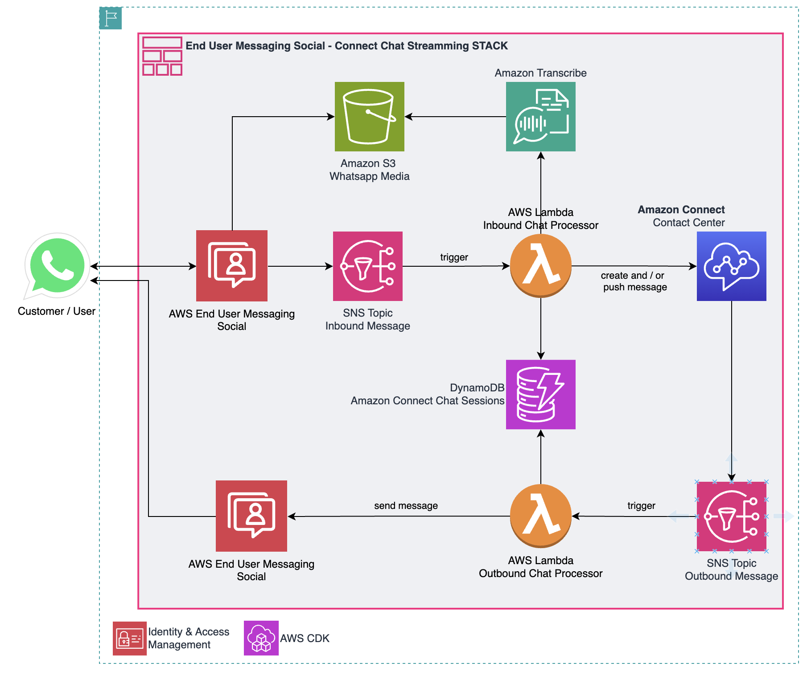
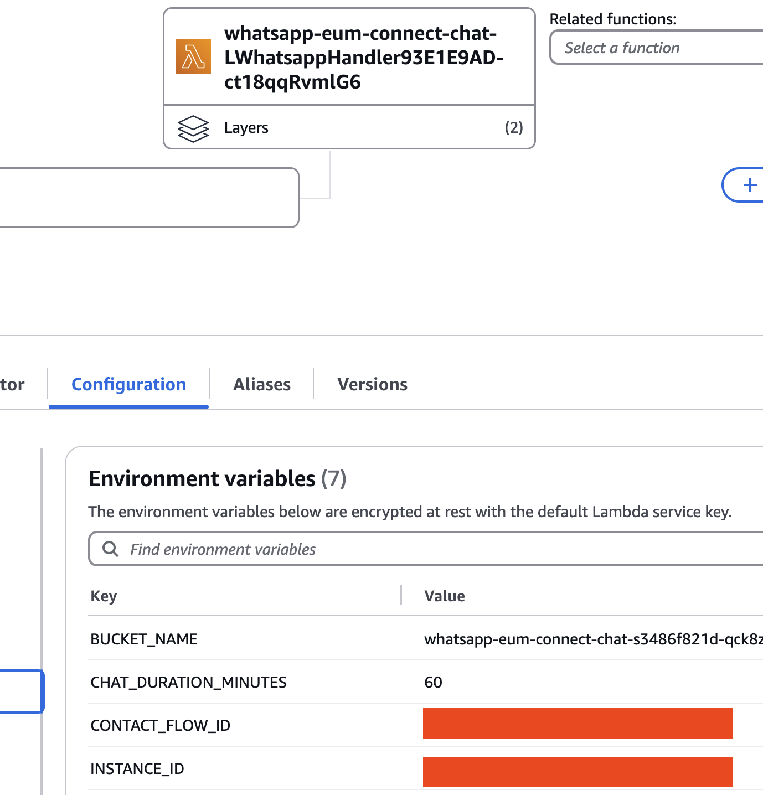
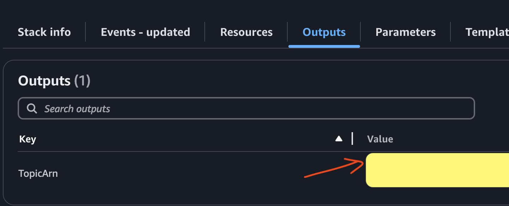
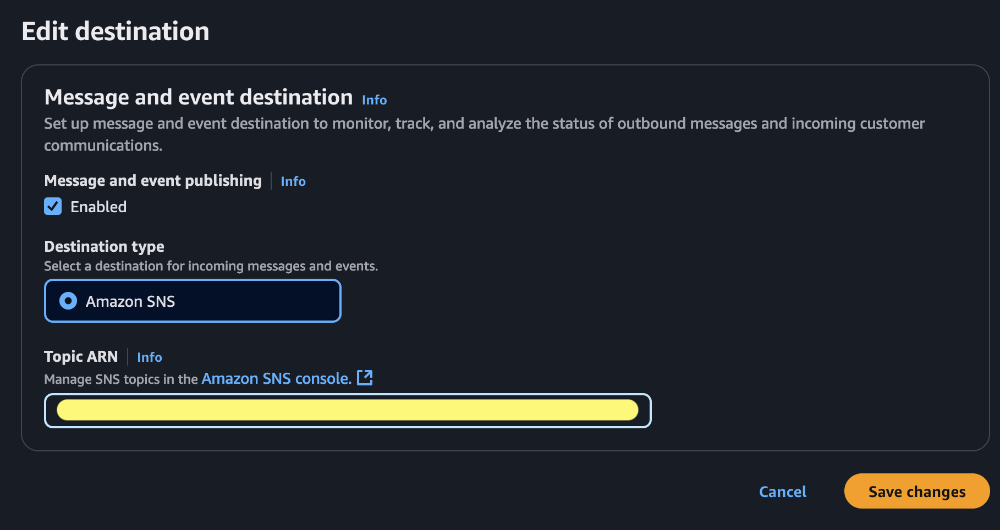

# WhatsApp Integration with Amazon Connect (with voice notes)

This project shows how to integrate WhatsApp messages through AWS End User Messaging with Amazon Connect to create a seamless customer service experience. While Amazon Connect has native WhatsApp integration, it has some limitations regarding message types and attachments (see [WhatsApp Business messaging capabilities and limitations with Amazon Connect
](https://docs.aws.amazon.com/connect/latest/adminguide/whatsapp-messaging-capabilities.html)). This project uses SNS integration to provide more flexibility in handling different message types. When a WhatsApp message is received, it automatically creates or continues a chat in Amazon Connect, and responses from agents are sent back to the WhatsApp user. If the user sends a voice note, that will be transcribed and used in the dialog using Amazon Transcribe


## Architecture 

The solution uses several AWS services to enable WhatsApp communication through Amazon Connect:
- AWS End User Messaging (EUM) for WhatsApp channel management
- Amazon Connect for chat functionality
- AWS Lambda for message processing and integration
- Amazon DynamoDB for conversation state management
- Amazon S3 for media file storage
- Amazon SNS Topic for event pub/sub




### Flow 
1. User sends a WhatsApp message
2. AWS End User Messaging Social (EUM-Social) receives the message send it to SNS Topic for inbound messages.
3. AWS Lambda function:
   - Creates or continues a chat in Amazon Connect
   - Stores message metadata in DynamoDB (Not message content)
   - Handles media files by uploading them to S3 
   - Optionally if voice note is received, it will be downloaded to s3 bucket and transcribed before sending to amazon connect chat.
4. Amazon Connect agent receives and responds to the message
5. Lambda function receives Connect response (via another SNS Topic) and sends it back to WhatsApp user via EUM API
6. User receives the response in WhatsApp

## Prerequisites

### 1) WhatsApp Business Account

To get started, businesses need to either create a new WhatsApp Business Account (WABA) or migrate an existing one to AWS. The main steps are described [here](https://docs.aws.amazon.com/social-messaging/latest/userguide/getting-started.html). In summary:

1. Have or create a Meta Business Account
2. Access AWS End User Messaging Social console and and link business account through Facebook embedded portal.
3. Ensure you have a phone number that can receive SMS/voice verification and add it to Whatsapp.


### 2) An Amazon Connect instance

You need a Amazon Connect Instance. If you don't have one already you can [follow this guide](https://docs.aws.amazon.com/connect/latest/adminguide/amazon-connect-instances.html).

### 3) CDK Setup
Note: If you you don't know what CDK is, please [start here](https://docs.aws.amazon.com/cdk/v2/guide/getting_started.html) and install cdk and dependencies, configure environment and boostrap your account and region.

## Deployment
This project uses AWS CDK for infrastructure deployment. Follow these steps:

Clone the repo:
```bash
git clone https://github.com/aws-samples/generative-ai-ml-latam-samples
```


Set up environment:
```bash
cd samples/whatsapp-eum-connect-chat
python3 -m venv .venv
source .venv/bin/activate  # On Windows use: .venv\Scripts\activate.bat
pip install -r requirements.txt
```

Deploy the stack:
```bash
cdk deploy
```
⚠️ Important: Deploy in the same region as your AWS End User Messaging configuration

## Post-deployment setup

### 1) AWS Lambda Environment Variables

After deployed, go to the `WhatsappHandler` Lambda function and update the `INSTANCE_ID` (your instance id) `CONTACT_FLOW_ID` (the contact flow used for chat session) and `CHAT_DURATION_MINUTES` (how long the chat will be active in connect) environment variables.

Here you can find the [Amazon Connect Instance Id](https://docs.aws.amazon.com/connect/latest/adminguide/find-instance-arn.html) and [Contact Flow ID](https://docs.aws.amazon.com/connect/latest/adminguide/find-contact-flow-id.html)




### 2) Add the event destination 

After deploying the stack, use the created SNS topic as your event destination in AWS End user messaging social console. The specific arn will be in the cloudformation output (or cdk deploy output).

cloudformation stack outputs:


AWS End user messaging social console:



## The `WhatsappHandler` Lambda function

The SNS topics basically invokes AWS Lambda with a list of records that follow [this structure](https://docs.aws.amazon.com/social-messaging/latest/userguide/managing-event-destination-dlrs.html). After parsing each record there is a provided `WhatsappService` class to easily save, react, read, and reply whatsapp messages:

[lambda_function.py](lambdas/code/whatsapp_event_handler/lambda_function.py)
```python
...
for message in whatsapp.messages:
    audio = message.get_audio(download=True)  # Check if there is audio
    transcription = None

    if audio.get("location"):  # it's been downloaded
        print("TRANSCRIBE IT")

        # transcribe using Amazon Transcribe
        transcription = transcribe_service.transcribe(audio.get("location"))
        message.add_transcription(transcription)

    #An existing conversation with Amazon Connect Chat
    contact = connections.get_contact(message.phone_number)

    # Get message text content    
    text = message.get_text()

    if transcription:
        # Reply the transcription to the user
        message.text_reply(f"🔊_{transcription}_")
        text =  transcription
    ...
```

From here, just follow Meta's messages structure and invoke [`send_whatsapp_message`](https://boto3.amazonaws.com/v1/documentation/api/latest/reference/services/socialmessaging/client/send_whatsapp_message.html) method from End User Social Service. For a complete list of the different messages you can send and examples, please refer to [this documentation](https://developers.facebook.com/docs/whatsapp/cloud-api/messages/text-messages). In this code you can implemente custom logic to handle reactions, images, videos, etc.

There is a boilerplate python code in [whatsapp.py](lambdas/code/whatsapp_event_handler/whatsapp.py) that provides mark as read, reply, and reaction to user's messages.


### Using Amazon Transcribe Streaming to understand Voice Audios

[Messages can contain media](https://developers.facebook.com/docs/whatsapp/cloud-api/reference/messages?locale=es_LA) (audio, images, etc). To leverage that audio it need to be downloaded and transcribed first. Code details in [transcribe.py](lambdas/code/whatsapp_event_handler/transcribe.py)

[Official Docs](https://docs.aws.amazon.com/social-messaging/latest/userguide/receive-message-image.html)

### Creating or using Amazon Connect Chat 

This code block handles the chat connection logic:
1. If a contact exists, it tries to send the message using the existing connection. If the connection is invalid, it removes the old contact and creates a new chat connection
2. If no contact exists, it creates a new chat connection from scratch. In all cases it stores/updates the connection details in the connections database

```python
if(contact):
    try:
        send_message_response = chat.send_message(text, contact['connectionToken'])
    except:
        print('Invalid Connection Token')
        connections.remove_contactId(contact['contactId'])
        print('Initiating connection')  
        contactId, participantToken, connectionToken = chat.start_chat_and_stream(
            text, message.phone_number, "Whatsapp", customer_name, message.phone_number_id)
        
        connections.update_contact(
            message.phone_number, "Whatsapp", contactId, participantToken, connectionToken, customer_name, 
            message.phone_number_id)
else:
    print("Creating new contact")
    contactId, participantToken, connectionToken = chat.start_chat_and_stream(
            text, message.phone_number, "Whatsapp", customer_name, message.phone_number_id)
    
    connections.insert_contact(message.phone_number, "Whatsapp", contactId, participantToken, connectionToken, customer_name, 
            message.phone_number_id)
```

## The `ConnectHandler` Lambda function

This function handles Amazon Connect responses to user. Basically retrieves connection tokens for that specific contact id and send the message back to user:

```python
...
customer = connections.get_customer(contactId)
if(customer):
    phone = customer['customerId']
    systemNumber = customer['systemNumber']
    send_whatsapp_text(message_body,phone, systemNumber)
...

def send_whatsapp_text(text_message, to, phone_number_id, meta_api_version="v20.0" ):
        message_object = {
            "messaging_product": "whatsapp",
            "recipient_type": "individual",
            "to": f"+{to}",
            "type": "text",
            "text": {"preview_url": False, "body": text_message},
        }

        kwargs = dict(
            originationPhoneNumberId=phone_number_id,
            metaApiVersion=meta_api_version,
            message=bytes(json.dumps(message_object), "utf-8"),
        )
        response = boto3.client("socialmessaging").send_whatsapp_message(**kwargs)
        print("replied to message:", response)
...
``` 

## Test your Aplication

In order to test the chatbot, go to your Amazon Connect Instance and [Open Contact control Panel (CCP)](https://docs.aws.amazon.com/connect/latest/adminguide/launch-ccp.html) and send a Whatsapp Message to the EUM Social number.


_(personal phone number blurred)_


## Cost Considerations
The main cost components for this solution are:
* [AWS End User Messaging](https://aws.amazon.com/end-user-messaging/pricing/)
    - Pay per message sent/received 0.005 USD
   - Conversation rate (24 thread) depends of conversartion categories.
* [AWS Lambda](https://aws.amazon.com/lambda/pricing/)
* [Amazon SNS](https://aws.amazon.com/sns/pricing/) (no charges for lambda delivery)
* [Amazon Connect Chat](https://aws.amazon.com/es/connect/pricing/): 0,004 USD per message 
* [Amazon DynamoDB](https://aws.amazon.com/dynamodb/pricing/) storing chat metadata

Optional costs:

* [Amazon Transcribe](https://aws.amazon.com/es/transcribe/pricing/) for audio transcription
* [Amazon S3](https://aws.amazon.com/es/s3/pricing/) for media storage

All serverless and pay as you go (no cost if no used)

For detailed pricing, refer to [AWS End User Messaging pricing](https://aws.amazon.com/end-user-messaging/pricing/).

## Decomission

In order to delete resources, ust `cdk destroy` if using cdk cli. Alternately go to cloudformation console an hit `Delete`

Enjoy!
